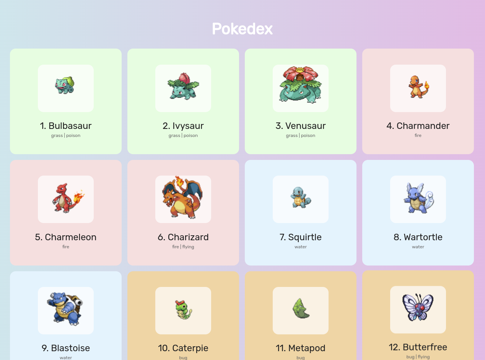

# Pokedex

Esse Projeto foi desenvolvido para colocar em prática os conhecimentos em JavaScript e API's

O Objetivo foi criar uma Pokedex ("*Uma enciclopédia de Pokemons*") Utilizando a [API](https://pokeapi.co) para obter os dados e exibir na pagina HTML usando o JavaScript

Link:https://allanfernds.github.io/pokedex/

## Tecnologias utilizadas
* HTML5
* CSS
* JavaScript
* API 

## Layout do projeto

### Autor

LinkedIn: https://www.linkedin.com/in/alan-fernandes-03096317b/

Instagram: https://www.instagram.com/_alanfernds/

E-mail: alanfernandes.mm@gmail.com

